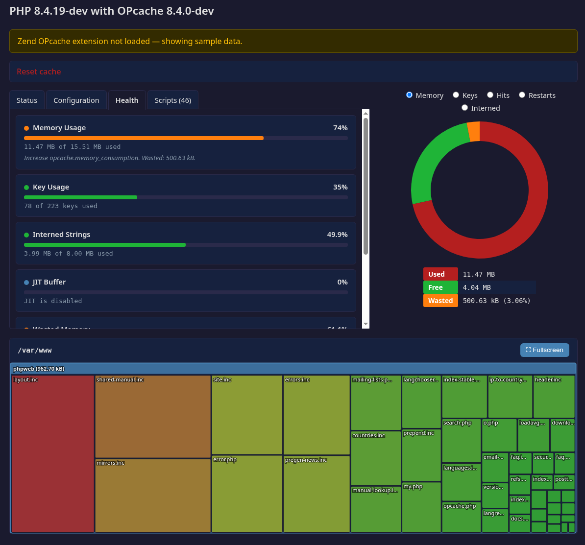

OPcache Status  [](https://packagist.org/packages/rlerdorf/opcache-status)
---------------

A single-file OPcache status page for PHP 8.2+. Drop `opcache.php` into any directory and get a full overview of your OPcache configuration, cached scripts, and health — zero external dependencies.



### Features

- **Status tab** — all `opcache_get_status()` metrics at a glance
- **Configuration tab** — current directives with changed values highlighted, inline documentation from php.net, and human-readable formatting (memory sizes, time values, percentages)
- **Health tab** — six checks (memory, keys, interned strings, JIT buffer, wasted memory, hit rate) with green/yellow/red indicators, progress bars, and tuning suggestions
- **Scripts tab** — sortable table of all cached scripts by hits, memory, or path
- **Donut charts** — memory, keys, hits, restarts, and conditionally JIT and interned strings
- **Squarified treemap** — interactive visualization of cached scripts by memory usage with drill-down navigation, inline and fullscreen modes
- **Dark mode** — automatic via `prefers-color-scheme`
- **Responsive** — CSS Grid layout adapts to narrow screens

Everything is self-contained in a single PHP file with inline CSS and vanilla JavaScript. No jQuery, no D3.js, no CDN scripts.

### Usage

Install the package:
```
composer require --dev rlerdorf/opcache-status dev-master
```

Drop it where you want it in your public folder:
```
ln -s vendor/rlerdorf/opcache-status/opcache.php ./public/
```

Open the file in your browser:
```
http://127.0.0.1:8000/opcache.php
```

If the Zend OPcache extension is not loaded, sample data from `data-sample.php` is shown automatically.

### Development

```
php -S localhost:8000
```

Then open `http://localhost:8000/opcache.php`. The fallback to sample data is based on `extension_loaded('Zend OPcache')`, not `opcache.enable`.

